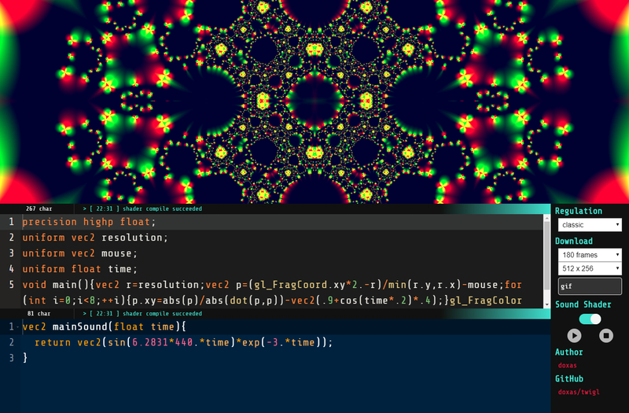

# twigl

twigl.app is GLSL code editor on the web.

⚡ [twigl\.app](https://twigl.app/) ⚡



## get started

```
$ npm install
$ npm start
```

## credit

[spite/ccapture\.js: A library to capture canvas\-based animations at a fixed framerate](https://github.com/spite/ccapture.js)

[jnordberg/gif\.js: JavaScript GIF encoding library](https://github.com/jnordberg/gif.js)

[Ace \- The High Performance Code Editor for the Web](https://ace.c9.io/)

[Shadertoy BETA](https://www.shadertoy.com/)

## license

MIT licensed.

