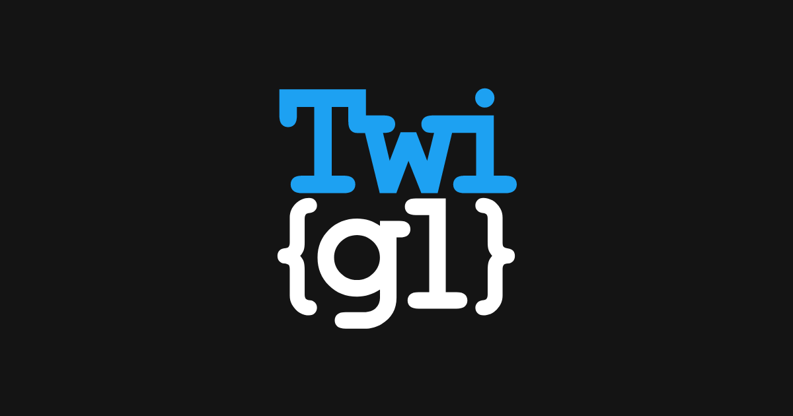
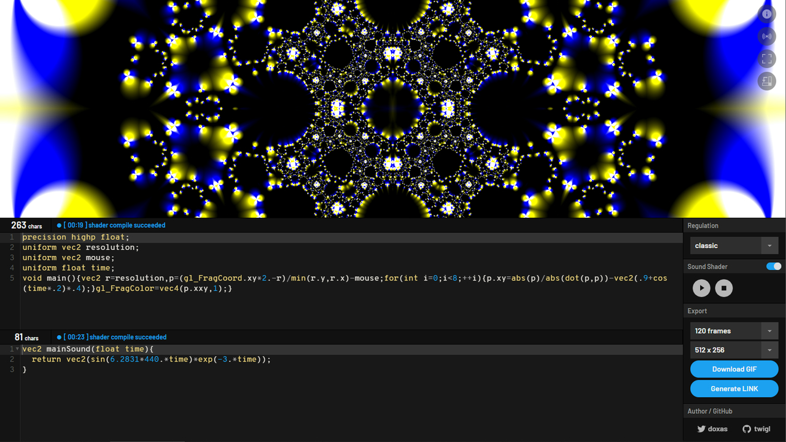
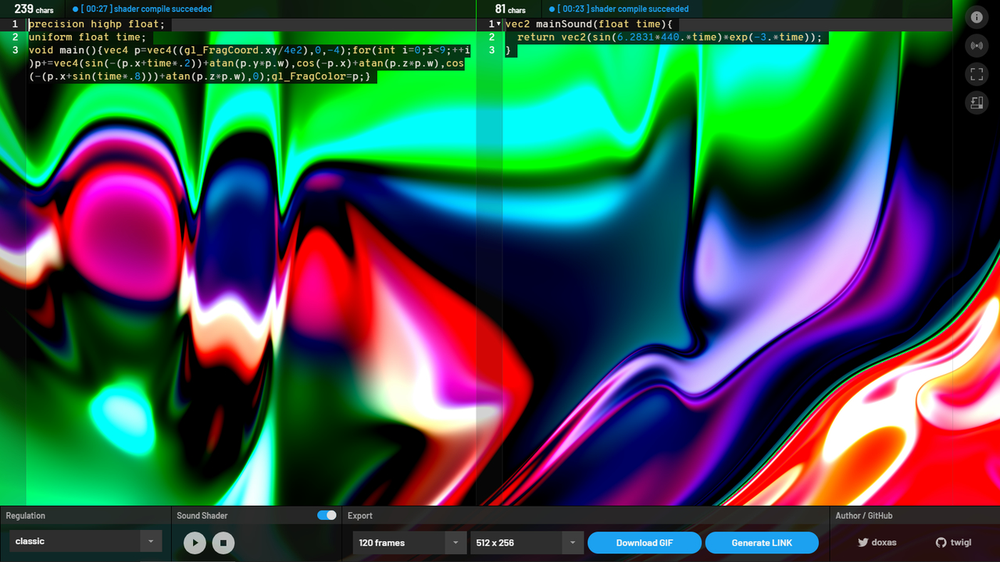
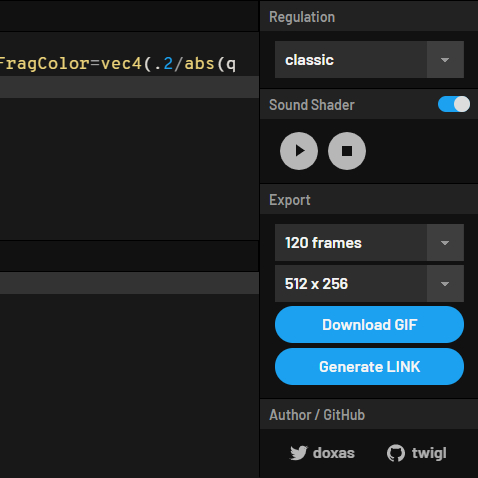

# twigl

twigl.app is an online editor for One tweet shader, with gif(or webm, jpeg, png) generator and sound shader, and broadcast live coding.

<div style="width: 100%; text-align: center;">
    
</div>

## get started

```
$ npm install
$ npm start
```

## screen shot

<div style="width: 100%; text-align: center;">
  
  
  
  
</div>

Example:

```glsl
precision highp float;
uniform float time;
void main(){vec4 p=vec4((gl_FragCoord.xy/4e2),0,-4);for(int i=0;i<9;++i)p+=vec4(sin(-(p.x+time*.2))+atan(p.y*p.w),cos(-p.x)+atan(p.z*p.w),cos(-(p.x+sin(time*.8)))+atan(p.z*p.w),0);gl_FragColor=p;}
```

Live: <a href="https://bit.ly/3aBelvb" target="_blank">DEMO</a>

## regulation

There are four modes in twigl.app, each of which has a sub-mode that uses GLSL ES 3.0, or in addition to it, a mode that enables MRT.

### classic:

This mode is compatible with GLSLSandbox.

The uniform variables are "resolution", "mouse", "time", "frame", and "backbuffer".

### geek:

In this mode, the various uniform variables are in a single-character style.

"r", "m", "t", "f", and "b", respectively.

### geeker:

In this mode, there is no need to declare precision and uniform. They are automatically complemented on the implementation side. Otherwise, it is the same as in geek mode.

### geekest:

In this mode, the description of "void main(){}" may be omitted (or not), and "gl_FragCoord" can be described as "FC". In addition, a variety of GLSL snippets are available.

The reason why we support the notation that does not omit the definition of the main function is to allow users to define their own functions.

For more information on snippets, please see below.

## advanced

### 300 es

GLSL ES 3.0 is available for WebGL 2.0 enabled environments.

When using GLSL ES 3.0, use `outColor` instead of `gl_FragColor` for the final output in classic mode.

In the other geek, geeker, and geekest modes, `outColor` is shortened to `o`.

### MRT (Multiple Render Targets)

In classic mode, `outColor0` and `outColor1` can be used to output to two channels simultaneously.

In non-classical mode, these are written as `o0` and `o1`.

The result of the previous frame can be referenced as `backbuffer0` and `backbuffer1` in classic mode. In other modes, they are written as `b0` and `b1`.

### Input from the sound shader

The audio data generated by the sound shader can be received as a uniform variable in the shader for graphics.

In classic mode, this is a floating-point variable named `sound`. In other modes, it is denoted as `s`.

## GLSL snippets in GEEKEST mode

twigl with geekest mode have included simplex-noise, you can call it as follows.

```glsl
float f = snoise2D(v.xy);
float g = snoise3D(v.xyz);
float h = snoise4D(v.xyzw);
```

If you are more concerned with speed than accuracy, the following functions may be more appropriate.

```glsl
// fract sin noise
float fsnoise(vec2 c){
    return fract(sin(dot(c, vec2(12.9898, 78.233))) * 43758.5453);
}

// fsnoise for macOS
float fsnoiseDigits(vec2 c){
    return fract(sin(dot(c, vec2(0.129898, 0.78233))) * 437.585453);
}

// for example
float i = fsnoise(v.xy);
float j = fsnoiseDigits(v.xy);
```

Other pre-defined constants and functions are as follows.

```glsl
vec3 hsv(float h, float s, float v){
    vec4 t = vec4(1.0, 2.0 / 3.0, 1.0 / 3.0, 3.0);
    vec3 p = abs(fract(vec3(h) + t.xyz) * 6.0 - vec3(t.w));
    return v * mix(vec3(t.x), clamp(p - vec3(t.x), 0.0, 1.0), s);
}

mat2 rotate2D(float r){
    return mat2(cos(r), sin(r), -sin(r), cos(r));
}

mat3 rotate3D(float angle, vec3 axis){
    vec3 a = normalize(axis);
    float s = sin(angle);
    float c = cos(angle);
    float r = 1.0 - c;
    return mat3(
        a.x * a.x * r + c,
        a.y * a.x * r + a.z * s,
        a.z * a.x * r - a.y * s,
        a.x * a.y * r - a.z * s,
        a.y * a.y * r + c,
        a.z * a.y * r + a.x * s,
        a.x * a.z * r + a.y * s,
        a.y * a.z * r - a.x * s,
        a.z * a.z * r + c
    );
}

const float PI = 3.141592653589793;
const float PI2 = PI * 2.0;
```

Note that the above snippets are only available in GEEKEST mode.

## keyboard shortcut

| key                  | action         |
|----------------------|----------------|
| Alt + `Enter`        | play sound     |
| Ctrl + Alt + `Enter` | stop sound     |
| Ctrl + Alt + `v`     | vim mode       |
| Ctrl + Alt + `t`     | change view    |
| Ctrl + Alt + `.`     | up font size   |
| Ctrl + Alt + `,`     | down font size |

You can use `Command` instead `Ctrl` on the macOS.

## credit

[spite/ccapture\.js: A library to capture canvas\-based animations at a fixed framerate](https://github.com/spite/ccapture.js)

[jnordberg/gif\.js: JavaScript GIF encoding library](https://github.com/jnordberg/gif.js)

[Ace \- The High Performance Code Editor for the Web](https://ace.c9.io/)

[ashima/webgl\-noise: Procedural Noise Shader Routines compatible with WebGL](https://github.com/ashima/webgl-noise)

[Shadertoy BETA](https://www.shadertoy.com/)

interface design by [@iY0Yi](https://twitter.com/iY0Yi)

## license

MIT licensed.

